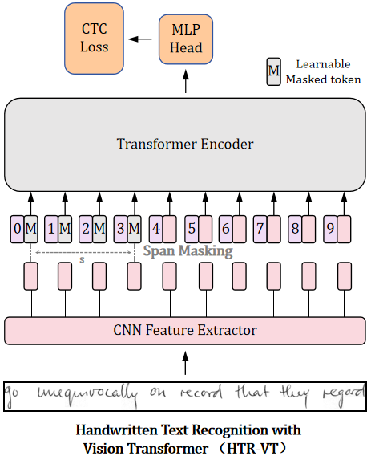
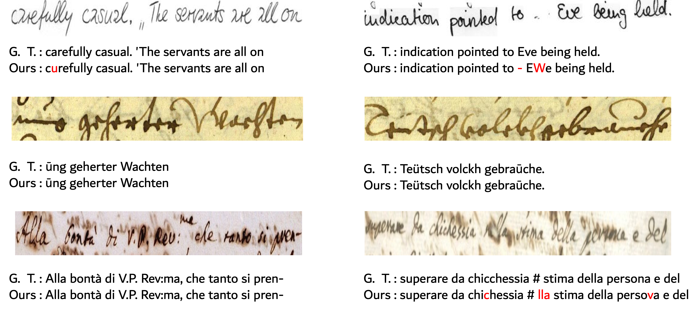

# 📙 HTR-VT (Pattern Recognition)
[](https://paperswithcode.com/sota/handwritten-text-recognition-on-lam-line?p=htr-vt-handwritten-text-recognition-with)

[](https://paperswithcode.com/sota/handwritten-text-recognition-on-read2016-line?p=htr-vt-handwritten-text-recognition-with)

[](https://paperswithcode.com/sota/handwritten-text-recognition-on-iam-line?p=htr-vt-handwritten-text-recognition-with)
### Introduction
This is the official implementation of our **Pattern Recognition(PR)** 2024 paper *"HTR-VT: Handwritten Text Recognition with Vision Transformer".* It's a new and effective baseline for handwritten text recognition solely using Vision Transformer and CTC Loss. If you find this repo useful, please give it a star ⭐ and consider citing our paper. Thank you.

[[Project Page]](https://yutingli0606.github.io/HTR-VT/)
[[Paper]](https://www.sciencedirect.com/science/article/abs/pii/S0031320324007180)
[[arXiv]](https://arxiv.org/pdf/2409.08573) 


## Table of Content
* [1. Overview](#1-overview)
* [2. Visual Results](#2-visual-results)
* [3. Installation](#3-installation)
* [4. Quick Start](#4-quick-start)
* [5. Citation](#5-citation)
* [6. Acknowledgement](#6-acknowledgement)

## 1. Overview
<p align="center">

</p>

## 2. Visual Results
<p align="center">

</p>

## 3. Installation

### 3.1. Environment

Our model can be learnt in a **single GPU RTX-4090 24G**
```bash
conda env create -f environment.yml
conda activate htr
```

The code was tested on Python 3.9 and PyTorch 1.13.0.


### 3.2. Datasets

* Using **IAM, READ2016 and LAM** for handwritten text recognition.

</summary>
  <details>
   <summary>
   IAM
   </summary>
    
    Register at the FKI's webpage :https://fki.tic.heia-fr.ch/databases/iam-handwriting-database)
    Download the dataset from here :https://fki.tic.heia-fr.ch/databases/download-the-iam-handwriting-database
  </details>
  <details>
   <summary>
   READ2016
   </summary>
    
    wget https://zenodo.org/record/1164045/files/{Test-ICFHR-2016.tgz,Train-And-Val-ICFHR-2016.tgz}
  </details>
  <details>
   <summary>
   LAM
   </summary>
    
    Download the dataset from here: https://aimagelab.ing.unimore.it/imagelab/page.asp?IdPage=46
  </details>
  
* Download datasets to ./data/.
Take IAM for an example:
The structure of the file should be:

```
./data/iam/
├── train.ln
├── val.ln
├── test.ln
└── lines
      ├──a01-000u-00.png
      ├──a01-000u-00.txt
      ├──a01-000u-01.png
      ├──a01-000u-01.txt
      ...
```


## 4. Quick Start
* We provide convenient and comprehensive commands in ./run/ to train and test on different datasets to help researchers reproducing the results of the paper.

## 5. Citation
If our project is helpful for your research, please consider citing :
```
@article{li2024htr,
  title={HTR-VT: Handwritten text recognition with vision transformer},
  author={Li, Yuting and Chen, Dexiong and Tang, Tinglong and Shen, Xi},
  journal={Pattern Recognition},
  pages={110967},
  year={2024},
  publisher={Elsevier}
}
```

## 6. Acknowledgement

We appreciate helps from public code: [VAN](https://github.com/FactoDeepLearning/VerticalAttentionOCR) and [OrigamiNet](https://github.com/IntuitionMachines/OrigamiNet).  
